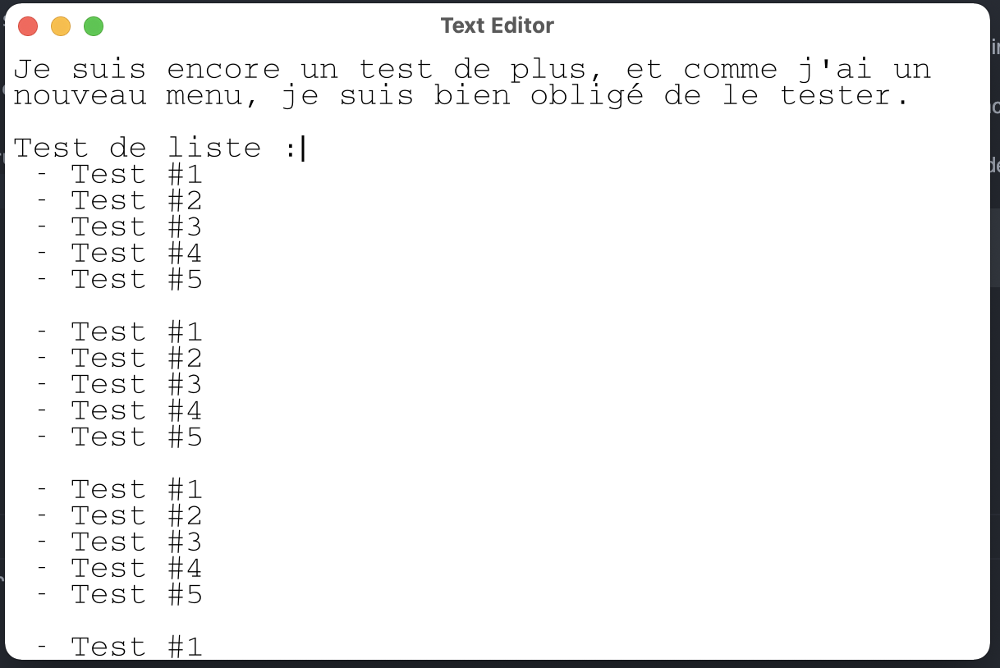

# Text Editor

*Text Editor* is a rust project aiming to recreate a modern textEdit (for mac).

It's focus on __speed__ and __efficiency__. The editor uses __animations__ to make the experience smoother than other ones.
*Text Editor* uses __pattern matching__ to recognize lists or parenthesis for instance.

For now, the editor look like this :


This editor is very light (1.5 Mo vs 37 for Vim) and doesn't consume much RAM or CPU while running thanks to render cycle optimization.


To run the projet (in debug mode) :
```bash
$ cargo run
```

#### List of the differents keybinds
| Shortcuts   | Actions          |
|-------------|------------------|
| `cmd + n`   | New file         |
| `cmd + s`   | Save file        |
| `cmd + o`   | Load a file      |
| `cmd + u`   | Underline        |
| `cmd + c`   | Copy             |
| `cmd + x`   | Cut              |
| `cmd + v`   | Paste            |
| `cmd + a`   | Select all       |
| `cmd + l`   | Select line      |
| `cmd + L`   | Delete line      |
| `cmd + d`   | Select word      |
| `cmd + D`   | Delete word      |
| `cmd + +/-` | Change font size |
| `cmd + w/q` | Exit             |

This projet is based on the [Speedy2D](https://github.com/QuantumBadger/Speedy2D/) crate for event loop and rendering.

---
2022 © Dorian Beauchesne